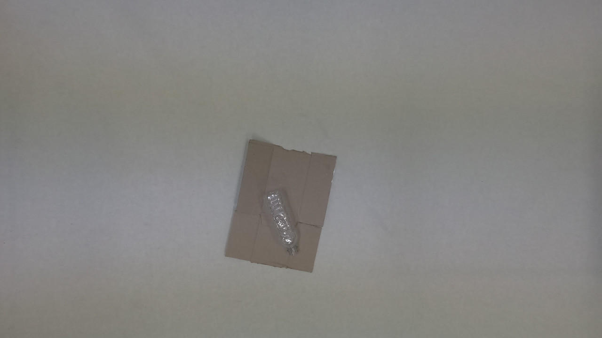
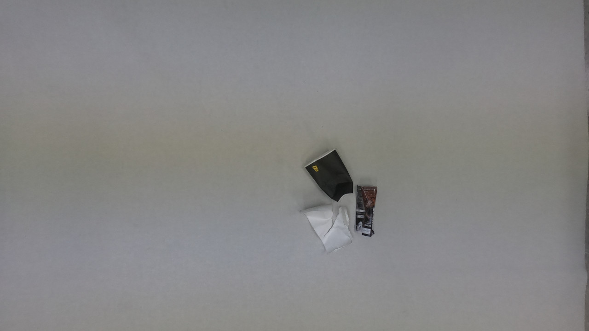
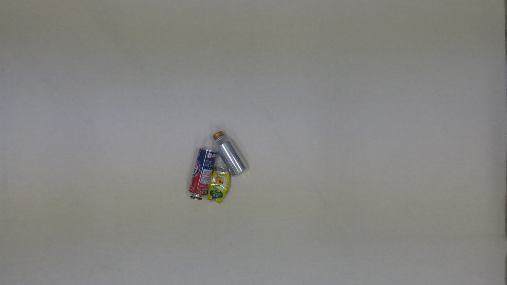

# 2020_AI_Grand_Challenge
'Korean Ministry of Science and ICT' hold the AI competition named '2020 AI Grand Challenge'.

I participated in the computer vision competition of that in 1st and 2nd round as a member of Computer vision start-up, 'Nuvi Lab'. And won <b>5th and 3rd winner</b> in each round.

<h5>
I did EDA, pre-processing, trained model, and implemented the total pipeline with other members. 
I trained single-label classifiers and tried some methodologies to make it perform better.
I added certificate pdf in 'certificate' directory.
</h5>

## Sample input images and outputs

<h4>Sample1</h4>
<h5>Input Image</h5>

<h5>Ouput : Paper, Plastic</h5>
<h4>Sample2</h4>
<h5>Input Image</h5>

<h5>Ouput : Paper</h5>
<h4>Sample3</h4>
<h5>Input Image</h5>

<h5>Ouput : Can, Plastic</h5>
